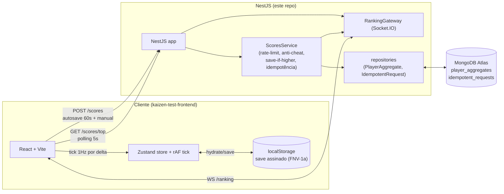
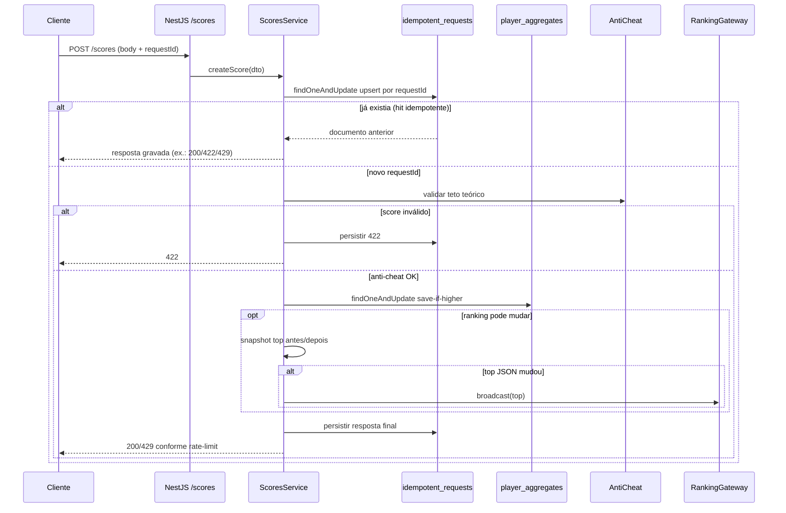

# Kaizen Clicker — Backend (NestJS + MongoDB)

API REST + WebSocket que serve o mini-game idle/clicker do desafio Kaizen Clicker.
O frontend correspondente vive em [kaizen-test-frontend](https://github.com/kevinmarangoni/kaizen-test-frontend).

## Como rodar

### Pré-requisitos

- Node **20 LTS**, Yarn 1.x.
- MongoDB acessível (Atlas, local ou via `docker-compose` deste repo).

### Local

```bash
cp .env.example .env            # preencha MONGODB_URI, CORS_ORIGIN, NODE_ENV
yarn install
yarn start:dev                  # http://localhost:3000
```

### Via Docker

```bash
docker compose up --build
# API em http://localhost:3000, Mongo em mongodb://localhost:27017
```

### Testes

```bash
yarn lint
yarn build
yarn test                       # Jest, ~17 specs
```

## Endpoints

| Método | Caminho                        | Descrição                                                                                  |
| ------ | ------------------------------ | ------------------------------------------------------------------------------------------ |
| POST   | `/scores`                      | Body: `playerName`, `score`, `improvements`, `elapsedSeconds`, `requestId` (UUID v4).      |
| GET    | `/scores/top?limit=10`         | Top N jogadores por melhor pontuação (cacheável, 5s).                                      |
| GET    | `/scores/me?playerName=x`      | Posição e melhor pontuação do jogador. Sem `playerName` retorna **400**.                   |

### WebSocket (ranking)

Namespace Socket.IO: `/ranking`. Evento emitido pelo servidor: `ranking` (array do top 10) com debounce + dedupe para evitar storm em rajadas de save.

## Arquitetura



### Fluxo `POST /scores` (idempotência + anti-cheat + broadcast)



## Decisões de senioridade

- **Idempotência atômica**: `POST /scores` grava a resposta com `findOneAndUpdate` + `$setOnInsert` (e tratamento de `E11000` em corrida), em vez de `create` seguido de releitura — evita duplicidade sob requisições paralelas com o mesmo `requestId`.
- **Save-if-higher atômico**: melhor pontuação atualizada com um único `findOneAndUpdate` condicional (`bestScore` menor que o novo score) + operadores `$max`/`$set`, eliminando perda de update entre leitura e escrita.
- **Índices Mongo**: índice composto em `player_aggregates` `{ bestScore: -1, playerName: 1 }`, reduzindo `COLLSCAN` em `getTop` / `getMe`.
- **Curto-circuito do snapshot do top**: o serviço só recalcula o JSON do top 10 quando o save pode alterar o ranking, reduzindo leituras redundantes.
- **Camada de repositórios**: `PlayerAggregateRepository` e `IdempotentRequestRepository` deixam o `ScoresService` focado em regra e facilitam mocks tipados em testes.
- **Logger estruturado com correlation id**: `nestjs-pino` com `genReqId` (UUID v4) propagado para `x-request-id` da resposta; filtro global `AllExceptionsFilter` padroniza payloads de erro com `{ statusCode, message, timestamp, requestId }`.
- **CORS endurecido**: em `NODE_ENV=production`, `CORS_ORIGIN` é obrigatório — bootstrap falha em vez de cair em `origin: true` com `credentials: true`. Gateway Socket.IO usa a mesma env.
- **Helmet + body limit**: `helmet()` e `json({ limit: '10kb' })` como defesa em profundidade.
- **Container non-root + healthcheck**: a imagem final do Render roda como usuário `app`, com `HEALTHCHECK` via `node` + `fetch('/scores/top?limit=1')`.

## Anti-cheat (REGRA 3)

O cliente envia `score`, `improvements` (níveis 0–5) e `elapsedSeconds` (tempo simulado sem pausa). O servidor calcula o **teto teórico** com essas melhorias:

1. `piecesPerSecond(levels)` reproduz o modelo do cliente: `basePiecesPerSecond × velocityMult × (oeePct / referenceOeeForThroughput) × andonThroughputMult`.
2. `maxGoodPiecesPerSecondTick(levels)` varre `productionCarry ∈ [0, 1)` e assume RNG sempre favorável (zero defeitos no tick), pegando o máximo de peças boas resultantes.
3. `clampElapsedSecondsForCeiling` trunca o tempo em 8h (regra 2).
4. Teto bruto = passo 2 × passo 3. Margem documentada: **+2% arredondado para cima + 15 pontos fixos** (cobre carry encadeado e arredondamentos).
5. Se `score > tetoComMargem`, responde **HTTP 422** com `ceilingRaw` e `ceilingWithMargin` no body.

Implementação: `src/scores/anticheat.service.ts` + `src/scores/game-simulation.ts`. Specs em `*.spec.ts` no mesmo diretório.

## Configuração

1. Copie `.env.example` para `.env`.
2. `MONGODB_URI` deve ser a string real do Atlas (menu *Connect* → *Drivers*). Em prod, o host é algo como `cluster0.xxxxx.mongodb.net` — se aparecer `cluster.example.mongodb.net` ou outro placeholder, o DNS falha com **ENOTFOUND**.
3. `CORS_ORIGIN` é obrigatório quando `NODE_ENV=production` (lista separada por vírgula).

## Deploy no Render (Docker)

1. Em [Render](https://render.com): **New → Blueprint** apontando para este repo. O `render.yaml` na raiz cobre runtime/healthcheck.
2. Preencha no painel as duas variáveis marcadas `sync: false`:
   - `MONGODB_URI`
   - `CORS_ORIGIN` (URL do Vercel, preenchida depois do front)
3. Copie a URL final do Render e cole em `VITE_API_URL` no projeto Vercel.

### Smoke test

```bash
curl -i "$RENDER_URL/scores/top"
# espera 200 OK + Cache-Control: public, max-age=5, must-revalidate
```

## Segurança

- Nunca commite `.env` nem credenciais. Se a connection string vazou, **gere nova senha** no Atlas e atualize o `.env`.
- Senha do Mongo no `.env` local **não é rotacionada** pelo código deste repo (pendência humana documentada como `env-rotate`).

## Estrutura

```
src/
  scores/
    dto/                  # CreateScoreDto (class-validator)
    schemas/              # PlayerAggregate, IdempotentRequest (índices)
    repositories/         # camada fina sobre os schemas
    anticheat.service.ts
    game-simulation.ts
    ranking.gateway.ts
    scores.controller.ts
    scores.service.ts
  common/                 # AllExceptionsFilter
  config/                 # GAME constants (espelhado no frontend)
  app.module.ts
  main.ts
```
